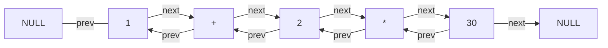
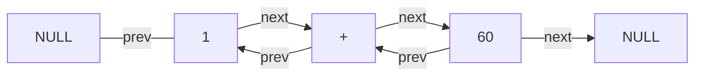
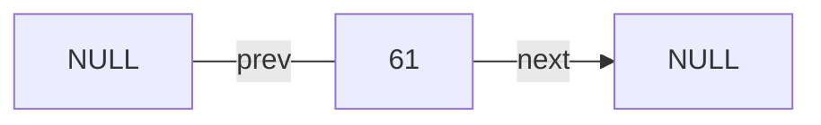

# C - Calculator
Hello, and welcome to the repo of my first ever C program!
I've started to learn the C language, and thought that the best way of doing it is creating a **cool program** that'll use the basic ideas of C  - and by that force me to learn them.
So I have decided to create a calculator :)

In this program you'll see management of pointers, structs, enums etc.
You'll see the usage of different libraries - such as stdio, stdlib, math and string.
You'll also see the implementation of 2 data structures (ADTs) - **linked list and queue**.
Handling errors, reading files, using recursion and more- let's *goto* the review ;)

## Review
The program itself is a simple scientific calculator.
It can calculate expressions that use the following material:
- Basic **operators**:	+ - * / ! % ^ (the last two are modulo and powers) 
- **Functions**: sin cos tan sqrt log ln abs
- **Constants**: e, pi, phi
- Manually stored **variables**: x, y, z (and ans for the last calculated answer)

It can also handle 5 user commands:
- ``help``, for viewing the titles of the program.
- ``history``, for *viewing the last 50 calculations* that have been done.
- ``quit``, for quitting the program manually and releasing dynamic memory.
- ``rad``, to set the calculator's mode to radians.
- ``deg``, to set the calculator's mode to degrees.

The program can handle various exceptions (I hope every possible one), such as:
- Typing either unknown words or symbols.
- Trying to calculate uncalculatable stuff, like diving by 0.
- Usage of unnecessary spaces, which is taken care elegantly.  

Let's hop to the cool part of the program - the algorithm itself.

## The Algorithm
So, how **do** you build a calculator?
I guess there are lots of ways, and I chose to following method:
1. Prompt for an expression from the user.
2. Check for basic validations:
	2.1. The length of the expression should be reasonable.
	2.2. Checking that a calculation is being requested and not variable's storage
	(because the user can type "x=pi^2" and use that variable x later on).
3. Calculate the expression:
	3.1. Create an empty linked list.
	3.2. Scan the expression, char by char.
	3.3. For each kind of char, if it is valid (something I know like a number and not an unfamiliar symbol), scan it do the end, make an Op struct out of it, and add it to the linked list. For example: scanning '4' will trigger a function that scans until it finds a non-digit number, and the result "420" will be added to the linked list.
	>**Note:** An Op struct contains type and value, so I can store different nodes with the same value. For example, { OPRAND, 69 } is an Op that stores the number 69, while { LETTER, 69 } stores the letter 'E', whose ascii value is 69.
	
	>**Note:** Scanning '(' will trigger a search for the corresponding ')' and a calculation of the inner expression, **recursively!**
	
	3.4. After scan is finished, we ask the linked list to calculate itself.
	It is done by several steps in order to preserve the precedence of arithmetic operators,  each step triggers a scan for the relevant operators.
	A calculation is done, and the irrelevant nodes of the list are released (relist lol).
	3.5. If no error occurred, the list should have one node and it's value is the requested answer, so we return that to the user.
4. Request for another expression, until the user types *"quit"*.

### An Example
Let's analyze the steps for calculating the next expression: ``1+2*30`` 
- The first char is ``1`` . We search for the end of the number, which is the next char.
So, the Op { OPRAND, 1 } is added to the list.
- The next char is ``+`` . We know that it's an operator, so the Op { OPERATOR, '+' }
is added to the list.
>**NOTE:** The actual Op is { OPERATOR, 43 } because that's the ascii value of '+'.
- The next 2 chars are handled the same.
- The next char is  ``3``. We search for the end of the number, and finally the
Op { OPRAND, 30 } is added to the list.

**Now let's check the calculations steps of the linked list:** 

>If a graph isn't viewed, use this extension: https://github.com/BackMarket/github-mermaid-extension

- The first scans of finding functions and operators (as ``!`` and ``^``) do nothing.
- The third scan (to find ``*``, ``/`` and ``%``) stops at the four node, which is ``*``.
The calculation *2 x 30* is being done and stored in the prev node of ``*`` while the ``*`` and ``30`` are released from the list, so the linked list now looks like this: 

- The next and final scan is for ``+`` and ``-``, so it stops in the second node.
The calculation *1 + 60* is being done and the ``+`` and ``60`` nodes are freed.
The form of the final list is:

The algorithm recognizes that only one node is left, so it's value is  returned as the answer to the expression, which is printed to the screen and **saved in the history queue**.

### Handling Errors and Exceptions
At first I though of placing the error checking in the validation function, **before** the calculation starts, but I found it inefficient and unpleasing for the user (because I need to start calculating in order to say *what* was the error, if one occurred).

So I have decided to handle errors **during** the calculation itself, which is less pleasing to the eye, but more efficient and user friendly.

If an error occurs during the expression scan (for example: an unknown symbol is typed),
an error message will appear and the INFINITY will be returned to the ``main`` function. In that case, I know that an error occurred and nothing is pushed to the history queue.

If an error occurs during the expression calculation itself, an error message will appear and the list is automatically becomes a list of one node with the value INFINITY.

>**Note:** What do I mean by "user friendly"? That a dynamic error message is printed, such as "ERROR: no @ symbols allowd" instead of the boring "SYNTAX ERROR" most calculators print (without telling **what** was the error).

###  Notes
- There are 3 ``.c`` files in the solution:
	- ``calculator.c``, which has the main algorithm and functions.
	- ``list.c``, which is the linked list ADT (and also calculates the expression).
	- ``queue.c``, which is the queue data structure for the history of calculations.
- There is also ``defines.h``, which holds the ``#define``s and ``typedef``s.
- The program also handles reading data from files, and if the ``titles.txt`` file is missing or changed - the program won't run.
- All of the possible words, Op types and errors are stored in *enums*.
- When checking for letters and words I decided to check it NOT case-sensitive, so that the program will become more user friendly (either pi, PI or Pi equal 3.14).
- I have tried not to exceed time and space complexity of O(n), and the usage of the queue for that one simple purpose (a list of history calculations) is solely for efficiency (O(1)).
- Limitations: rounding starts at a difference of 0.000000001, so 6.999999999 = 7. Moreover, the program is having difficulties in managing large numbers (it might return 0 or -2.14748e+009, but anyway it won't collapse :D )

## Summary
The calculator's purpose was helping me learn the C language, so when I could use std functions I DID use them - as they are essential for learning the language (in my opinion).

Only when I had to I've created my own functions, because the program for me is NOT about how to calculate sin and cos (although it might be interesting to implement a Taylor series for calculating sin by myself), but about **developing** a program in C and use the tools I never touched before - like pointers and structs.

However, I did find it interesting to generate my own ADTs (linked list and queue) instead of copying them from the internet, because it served the purpose of learning C (writing ADTs as structs and not classes was new for me). 

*If you made it all the way to here I have to say that I appreciate you a lot!
You are more than welcome to contact me and tell your thoughts about the program :)*

Yehonatan Simian, 2021 Ⓒ
yonisimian@gmail.com